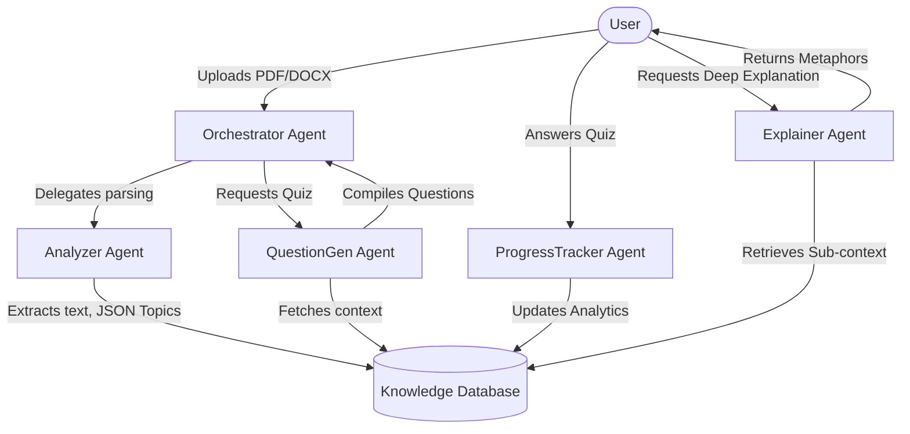

# Smart Study Assistant - Multi-Agent Learning System

A vivid, intelligent, and interactive platform leveraging a swarm of specialized AI agents to help you learn faster and deeper. Upload documents and watch as the orchestrated system digests knowledge, generates personalized adaptive quizzes, and provides deep conceptual explanations on demand.

## 🚀 Key Features

*   **⚡ Multi-Agent Swarm**: 
    *   **Orchestrator**: The central brain coordinating workflows.
    *   **Analyzer**: Parcels heavy PDFs/DOCX files into structured topics.
    *   **QuestionGen**: Crafts rigorous, multi-level adaptive quizzes.
    *   **Explainer**: Steps in mid-quiz with rich, metaphorical conceptual breakdowns.
    *   **ProgressTracker**: Synthesizes global and topic-level mastery trajectories.
*   **📊 Dynamic Dashboards**: Beautiful, vibrant data visualizations of your learning curve using standard analytics.
*   **🧠 Real-Time Agent Logs**: Watch the "thought process" of the AI swarm operating in parallel inside the beautiful terminal UI.
*   **🎨 Premium UI**: Rich gradients, glassmorphic elements, and engaging micro-interactions built with Tailwind CSS.

## 🏗️ Architecture



## 🛠️ Stack

*   **Next.js 15 (App Router)** - React Framework
*   **TypeScript** - Type Safety
*   **Tailwind CSS** - Styling
*   **Drizzle ORM & SQLite** - Local persistent lightweight DB
*   **@google/genai (Gemini 3.5 Flash)** - Blazingly fast LLM logic
*   **Recharts** - Data visualization

## 📦 Setup & Run Locally

1. **Install Dependencies**
   ```bash
   npm install
   ```

2. **Environment Variables**
   Ensure `.env` contains your API key. (See `.env.example`).
   ```bash
   GEMINI_API_KEY="AI..."
   ```

3. **Database Setup**
   The project uses SQLite via `drizzle-orm`. Push the schema to the local db:
   ```bash
   npx drizzle-kit push
   ```

4. **Run Development Server**
   ```bash
   npm run dev
   ```

5. **Open** `http://localhost:3000`

## 🌍 Deployment (Vercel)

1. Push to GitHub.
2. Link project in Vercel.
3. Use Build Command `npm run build` and Output Directory `.next`.
4. Add environment variables. For SQLite, swap `@libsql/client` URL out to a Turso database URL for Edge compatibility.
