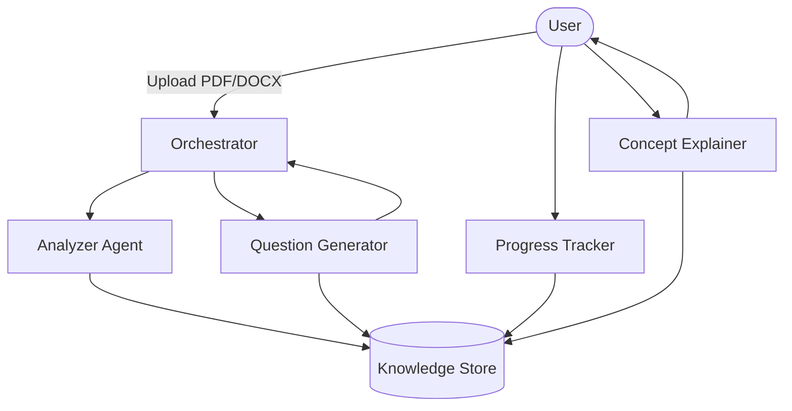

# 📚 Smart Study Assistant

> **An Intelligent Multi-Agent Learning Platform for Personalized Learning**

<p align="center">


</p>

<p align="center">


</p>

---

## 🚀 Overview

Smart Study Assistant transforms static study material into an interactive learning experience using a collaborative **Multi-Agent AI architecture**.

Instead of relying on a single AI model for every task, specialized agents work together to analyze documents, generate quizzes, explain difficult concepts, and monitor learning progress.

---

# ✨ Features

### 🤖 Multi-Agent Intelligence

| Agent | Responsibility |
|------------|---------------------------------------------|
| 🎯 Orchestrator | Coordinates and manages the complete workflow |
| 📄 Analyzer | Extracts structured topics from PDF/DOCX files |
| ❓ Question Generator | Creates adaptive quizzes with multiple difficulty levels |
| 💡 Explainer | Produces simple explanations and real-world analogies |
| 📈 Progress Tracker | Tracks mastery and generates learning analytics |

---

### 📚 Smart Learning

- Upload PDF and DOCX study materials
- Automatic concept extraction
- AI-generated adaptive quizzes
- Context-aware concept explanations
- Instant feedback and scoring

---

### 📊 Analytics Dashboard

Track your learning with

- Topic mastery
- Quiz performance
- Progress over time
- Weak area identification
- Personalized insights

---

### 🔍 Transparent AI Workflow

Visualize how agents collaborate in real time through

- Agent communication logs
- Execution timeline
- Workflow visualization
- Decision traceability

---

### 🎨 Modern User Experience

- Glassmorphism UI
- Dark theme
- Responsive design
- Smooth animations
- Beautiful dashboards

---

# 🏗️ System Architecture



---

# 🔄 Multi-Agent Workflow

```
Upload Document
        │
        ▼
Orchestrator Agent
        │
        ▼
Document Analysis
        │
        ▼
Knowledge Extraction
        │
        ▼
Parallel Agent Execution
    ├── Quiz Generation
    ├── Concept Explanation
    └── Progress Evaluation
        │
        ▼
Interactive Dashboard
```

---

# 🛠️ Tech Stack

| Category | Technology |
|-----------------|-----------------------------|
| Frontend | Next.js 15 |
| Language | TypeScript |
| Styling | Tailwind CSS |
| Database | SQLite |
| ORM | Drizzle ORM |
| AI SDK | Google GenAI |
| Charts | Recharts |

---

# 📂 Project Structure

```
smart-study-assistant/

├── app/
├── components/
├── agents/
│   ├── orchestrator/
│   ├── analyzer/
│   ├── question-generator/
│   ├── explainer/
│   └── progress-tracker/
├── lib/
├── db/
├── public/
└── README.md
```

---

# ⚙️ Getting Started

## 1. Install Dependencies

```bash
npm install
```

## 2. Configure Environment

Create a `.env` file.

```env
GEMINI_API_KEY=your_api_key
```

---

## 3. Initialize Database

```bash
npx drizzle-kit push
```

---

## 4. Start Development Server

```bash
npm run dev
```

Open

```
http://localhost:3000
```

---

# 📈 Learning Pipeline

```
Study Material

      │

      ▼

Document Analysis

      │

      ▼

Concept Extraction

      │

      ▼

Quiz Generation

      │

      ▼

Concept Explanation

      │

      ▼

Performance Evaluation

      │

      ▼

Progress Tracking
```

---

# 🔮 Roadmap

- 🎙️ Voice Tutor
- 🃏 Flashcard Generation
- 📅 AI Study Planner
- 👥 Collaborative Study Rooms
- 🔁 Spaced Repetition Engine
- 🌍 Multi-language Support
- 📱 Mobile Optimization

---

# 🌟 Why Multi-Agent?

Compared with traditional single-agent assistants, this architecture provides:

- Better task specialization
- Improved output consistency
- Transparent execution flow
- Modular scalability
- Easier maintenance and extension

---

# 🤝 Contributing

Contributions are welcome.

1. Fork the repository
2. Create a feature branch

```bash
git checkout -b feature/new-feature
```

3. Commit your changes

```bash
git commit -m "Add new feature"
```

4. Push the branch

```bash
git push origin feature/new-feature
```

5. Open a Pull Request

---

# 📄 License

This project is released under the **MIT License**.

---

<p align="center">

### 📚 Smart Study Assistant

**Transforming learning into an intelligent, interactive, and personalized experience through Multi-Agent AI.**

</p>