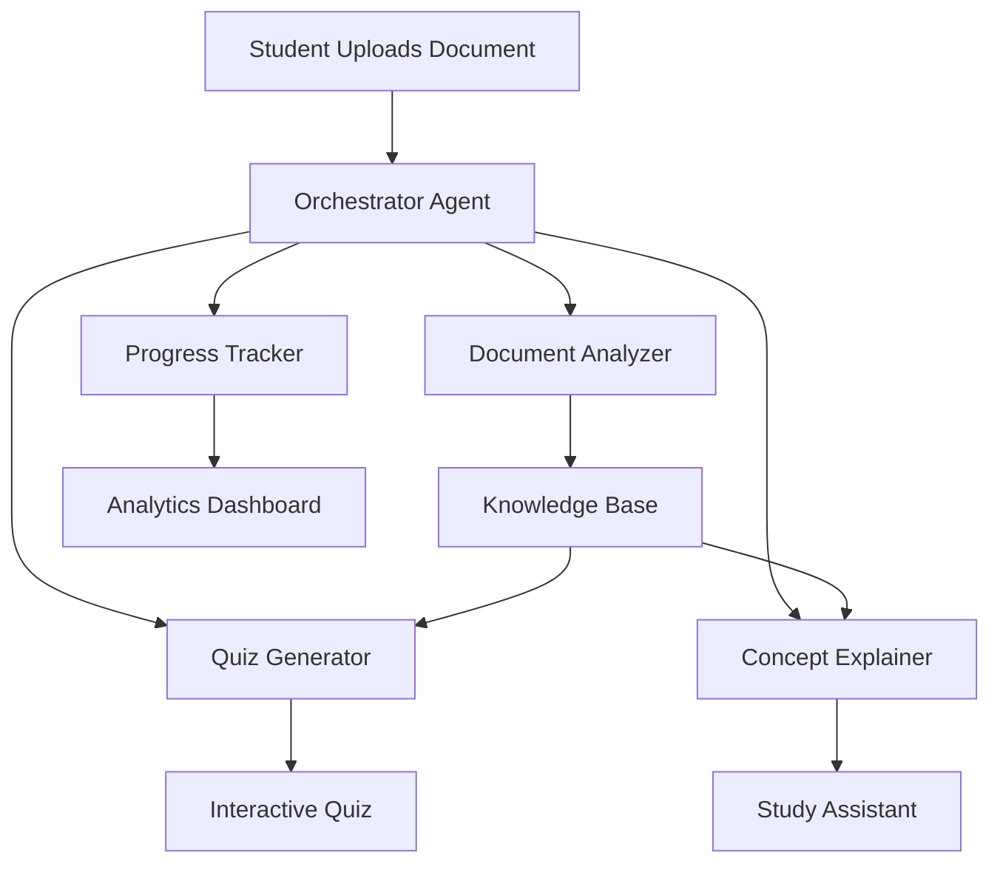

# 📚 Smart Study Assistant
### An Intelligent Multi-Agent Learning Platform powered by AI

<p align="center">


</p>

<p align="center">

A modern AI-powered study companion that transforms static learning materials into an interactive and personalized learning experience through a collaborative multi-agent architecture.

</p>

---

## 🚀 Overview

Smart Study Assistant leverages multiple specialized AI agents that work together to analyze study materials, explain difficult concepts, generate quizzes, and monitor learning progress.

Instead of a single chatbot trying to perform every task, each agent has a dedicated responsibility, making the system more modular, explainable, and scalable.

---

## ✨ Key Features

### 📄 Document Intelligence

- Upload PDF and DOCX study materials
- Automatic text extraction
- Content segmentation and preprocessing
- Context-aware document analysis

---

### 🤖 Multi-Agent AI Architecture

Five specialized AI agents collaborate seamlessly:

| Agent | Responsibility |
|------------|--------------------------------|
| 🎯 Orchestrator | Coordinates the complete workflow |
| 📖 Analyzer | Extracts concepts and important topics |
| ❓ Quiz Generator | Creates personalized MCQs |
| 💡 Concept Explainer | Simplifies difficult ideas with examples |
| 📊 Progress Tracker | Monitors performance and learning trends |

---

### 📝 Adaptive Quiz Generation

- Multiple Choice Questions
- Difficulty Levels
    - Easy
    - Medium
    - Hard
- Instant Feedback
- Score Tracking

---

### 💡 Intelligent Concept Explanation

Receive explanations that include:

- Simple language
- Real-world analogies
- Step-by-step breakdowns
- Key takeaways
- Memory tips

---

### 📈 Learning Analytics

Visual dashboard displaying

- Quiz Performance
- Topic Mastery
- Learning Progress
- Weak Areas
- Study Insights

---

### 🔍 Agent Transparency

Observe how AI agents collaborate internally.

- Agent communication logs
- Workflow visualization
- Decision traceability
- Execution pipeline

---

## 🏛️ System Architecture



---

## ⚙️ Technology Stack

### Frontend

- Next.js 14
- React
- TypeScript
- Tailwind CSS

### UI

- Framer Motion
- Lucide Icons
- Glassmorphism Design
- Responsive Layout

### AI

- Multi-Agent Architecture
- LLM Orchestration
- Prompt Engineering
- Context Management

### Backend

- Next.js API Routes
- Server Actions
- File Processing Pipeline

---

## 📂 Project Structure

```
study-assistant/
├── app/
│   ├── (main)/
│   │   ├── dashboard/
│   │   ├── quiz/
│   │   ├── explain/
│   │   └── page.tsx
│   ├── api/
│   │   ├── upload/
│   │   ├── analyze/
│   │   ├── quiz/
│   │   ├── explain/
│   │   └── progress/
│   └── layout.tsx
├── components/
│   ├── ui/ (shadcn components)
│   ├── AgentLog.tsx
│   ├── QuizCard.tsx
│   ├── ProgressChart.tsx
│   └── ...
├── lib/
│   ├── agents/ (orchestrator, analyzer, etc.)
│   ├── documentParser.ts
│   ├── llm.ts
│   ├── db.ts
│   └── utils.ts
├── prisma/ (or drizzle)
├── public/
├── data/ (sample documents)
├── .env.example
├── next.config.js
├── tailwind.config.ts
├── tsconfig.json
└── README.md
```

---

## 🎯 Multi-Agent Workflow

```
Document Upload

↓

Orchestrator Agent

↓

Document Analysis

↓

Knowledge Extraction

↓

Parallel Execution

├── Quiz Generation

├── Concept Explanation

└── Progress Evaluation

↓

Interactive Dashboard
```

---

## 🎨 User Experience

✔ Modern Dark Theme

✔ Frosted Glass Components

✔ Smooth Animations

✔ Responsive Design

✔ Accessible Interface

✔ Clean Information Hierarchy

---

## 📊 Learning Pipeline

```
Upload Notes
        │
        ▼
Analyze Content
        │
        ▼
Extract Concepts
        │
        ▼
Generate Quiz
        │
        ▼
Explain Concepts
        │
        ▼
Evaluate Performance
        │
        ▼
Track Progress
```

---

## 🚀 Getting Started

Clone the repository

```bash
git clone https://github.com/SAKETH-V/smart-study-assistant.git
```

Install dependencies

```bash
npm install
```

Run locally

```bash
npm run dev
```

Open

```
http://localhost:3000
```

---

## 🔮 Future Enhancements

- Voice-based tutoring
- Flashcard generation
- AI Study Planner
- Collaborative learning rooms
- Spaced repetition engine
- Personalized recommendations
- Multi-language support

---

## 🌟 Why Multi-Agent?

Unlike traditional single-agent assistants, this system:

- Improves task specialization
- Produces more consistent outputs
- Enables transparent reasoning
- Scales independently
- Supports modular development

---

## 🤝 Contributing

Contributions, suggestions, and feature requests are welcome.

1. Fork the repository
2. Create a feature branch
3. Commit your changes
4. Open a Pull Request

---


*Transforming learning into an intelligent, interactive experience.*

</p>
